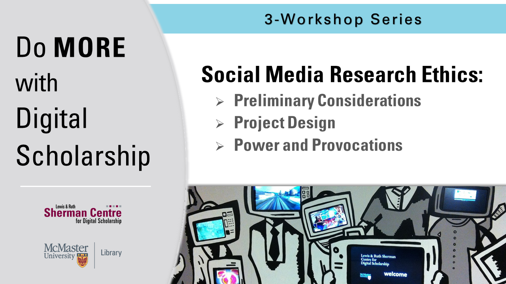

<!-- Edit the content below for the workshop in question. Once you're ready to publish, remove the comment characters e.g. "<!--" at the start and end -->

# Welcome to the Social Media Research Ethics module series.
As researchers across disciplines incorporate social media platforms and data into their research, questions surrounding the ethical complexities of such research continue to proliferate. This trio of modules—-part of the Sherman Centre’s 2020-2021 [Do More with Digital Scholarship](https://scds.ca/events/dmds/2020-2021/) workshop series—-identifies and explores some of the key methodologies, recurring ethical challenges, and embedded power dynamics of social media research. Rather than offering a unified program or checklist approach to social media research ethics, these modules will help participants to enact ethical decision-making throughout the research process (including project design, choice of methods, data management and stewardship, and research presentation or dissemination) while also facilitating a trans-disciplinary and reflexive conversation about what it means to frame social media research in terms of ‘ethics.’

**Ready to get started?** Navigate to the first module: [Preliminary Considerations](module1).

<!--

You might not think of numbers and locations as Humanities data, but it all depends on how you use them! Working with numeric and spatial data, you will learn how to create visualizations in [Tableau](https://www.tableau.com/).

Proceed to the [Preparation](preparation) page to get started.
-->

